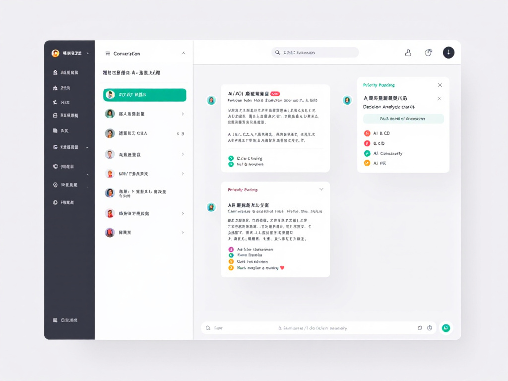
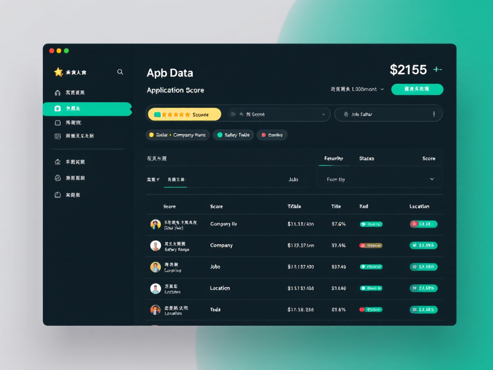
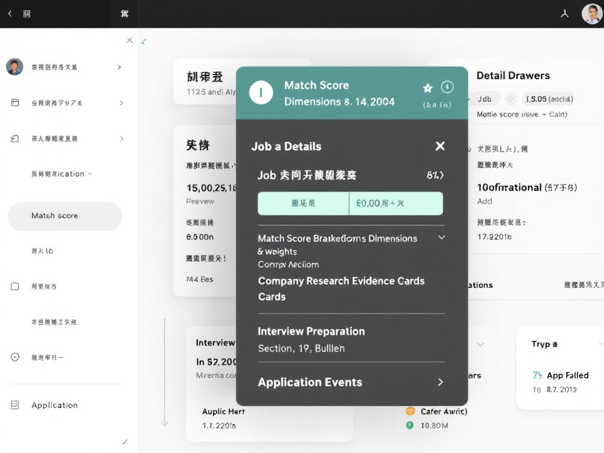

<div align="center">

# job-one-stop

### 本地优先的个人求职助手

[](#-快速开始)
[](https://fastapi.tiangolo.com/)
[](https://vitejs.dev/)
[](LICENSE)

数据不出本机 · 不自动投递 · 不自动发消息

</div>

## 📷 截图

|                    聊天决策                    |                    岗位管理                    |
| :--------------------------------------------: | :--------------------------------------------: |
|   |   |

|                    岗位详情                    |
| :--------------------------------------------: |
|  |

## ✨ 核心功能

- **决策聊天**：通用聊天 + 岗位专属聊天；支持文字、链接、截图，先运行本地硬规则，再由可选 AI 给出优先级、风险和下一步
- **岗位池管理**：多来源采集（BOSS / 智联 / 公众号 / beBee / CSV）、跨来源去重、状态流转、批量操作、软删除回收站
- **采集人工初筛**：采集回来的全新岗位先过区域白名单，按匹配分排序挂进聊天候选，你勾选后才入库；噪音不再自动落盘
- **公司调研**：沉淀官网、招聘页、小红书、脉脉、看准等证据
- **智能评分**：按岗位匹配、薪资、成长性、稳定性、口碑等维度输出 100 分解释
- **面试准备**：生成 JD 摘要、技能差距、优势话术、STAR 素材、反问问题；配置 AI 后按 JD + 个人画像定制
- **跟进任务 & 提醒**：把投递、沟通、调研动作沉淀为本地任务；fit / 面试中久无进展的岗位自动标记「需跟进」
- **晨间日清单**（可选）：每天定时把看板到期动作 + 需跟进岗位经 Telegram 推给本人
- **回收站**：删除岗位 / 公司不丢数据，30 天内可恢复或永久删除

## 🚀 快速开始

### 方式一：一条命令启动（Linux / WSL / macOS）

```bash
git clone https://github.com/你的用户名/one-stop-job.git
cd one-stop-job
./quickstart.sh
```

自动完成：Python 虚拟环境 → 前端依赖 → 配置文件 → 前端构建 → 后端启动。访问 http://127.0.0.1:8000/

### 方式二：Docker

```bash
git clone https://github.com/你的用户名/one-stop-job.git
cd one-stop-job
cp .env.template .env   # 按需填入 API Key
docker compose up -d --build
```

访问 http://127.0.0.1:8000/

### 方式三：桌面应用下载（无需任何开发环境）

前往 [Releases](../../releases) 页面，下载对应平台的安装包：
- **Windows**: 下载 .msi 或 .exe，双击安装
- **macOS**: 下载 .dmg，拖入 Applications（首次打开需右键 -> 打开）
- **Linux**: 下载 .AppImage，chmod +x 后双击运行

> 首次启动可能提示未知开发者——这是正常的（未签名），按系统提示确认即可。

### 方式四：日常使用（已装好依赖后）

```bash
scripts/app.sh start    # 启动（单进程，同时提供页面与 API）
scripts/app.sh status   # 状态
scripts/app.sh stop     # 停止
scripts/app.sh logs     # 日志
scripts/app.sh backup   # 数据备份
```

> **Windows 用户**：双击 `start_app.bat`，或使用 WSL。

<details>
<summary><b>详细说明（含本地开发热更新模式）</b></summary>

见 [QUICKSTART.md](QUICKSTART.md)

</details>

## 📖 主要文档

| 文档 | 说明 |
|------|------|
| [QUICKSTART.md](QUICKSTART.md) | 快速开始指南（本地 / Docker / Windows / Linux） |
| [CLAUDE.md](CLAUDE.md) | 项目架构标准（AI 与人类共同遵守） |
| [docs/maintenance-guide.md](docs/maintenance-guide.md) | 日常使用流程、维护入口、故障定位 |
| [docs/operations.md](docs/operations.md) | 运行部署、数据备份、运行排障 |
| [docs/restore-on-new-machine.md](docs/restore-on-new-machine.md) | 换机 / 重装还原清单 |

<details>
<summary>开发者文档</summary>

- [docs/data-flow.md](docs/data-flow.md) - 数据流架构
- [docs/testing-system.md](docs/testing-system.md) - 测试体系
- [docs/handoff.md](docs/handoff.md) - 项目交接清单

</details>

## 🎯 核心设计原则

1. **本地优先**：单用户、SQLite、无账号体系、数据不出本机
2. **不自动化对外动作**：不自动投递、不自动发消息、联系方式仅本地留存
3. **来源解耦**：统一数据管线，新增来源不影响评分 / 面试准备逻辑
4. **AI 可选**：决策聊天、公众号抽取、面试准备可接 AI；聊天先执行本地规则，调用失败时保留规则判断
5. **合规抓取**：仅公开内容、低频、人工触发、不破解验证码、不二次分发
6. **KISS 优先**：聊天保持主入口，低频求职管理能力按需展开

## 🔌 数据来源

所有来源汇入同一条管线（采集器 → 规范化 → 区域过滤 → 已知刷新 / 全新进候选 → 你勾选后入库 → 评分），互不耦合。

| 来源 | 触发方式 | 说明 |
|------|---------|------|
| **BOSS 直聘** | 宿主机脚本 / 定时 / Telegram `/collect` | 需安装 OpenCLI |
| **智联招聘** | 宿主机脚本 | 需安装 OpenCLI，默认禁用 |
| **公众号** | 粘贴导入 | 粘贴元宝回答或链接，自动拆分多岗位 |
| **beBee** | 配置采集 | 解析页面 JobPosting JSON-LD |
| **CSV / Excel** | 文件上传 | 支持自定义字段映射，直接入库 |
| **手动录入** | 表单填写 | 单条岗位快速录入，直接入库 |
| **Telegram 截图 / 文本** | 手机发消息 | 先写聊天候选，本人确认后入库 |

<details>
<summary><b>📱 手机一键入库 + 在线建议（Telegram，可选）</b></summary>

离开电脑时，用 Telegram 把岗位链接或截图发给自己的 bot。后端只抽取候选并写入本地聊天，默认不入库；你在 Web 聊天里勾选要沉淀的岗位再点「入库选中」。

**回执里直接带判断**：识别到候选后，后端会按你的个人决策规则 + 画像给出初步建议（优先级 / 方向 / 下一步），随回执一起发到手机。

**在手机上追问**：以 `?` 或 `/ask` 开头发消息即为提问，回答落进本地聊天同时发回手机。多候选时用 `?2` 指名问第几个。

**启用步骤**：

1. 在 Telegram 找 `@BotFather` 创建 bot，拿到 token
2. `.env` 加 `TELEGRAM_BOT_TOKEN=你的token`
3. 给 bot 发一条消息，用 `@userinfobot` 查到你的 chat id
4. `config.yaml` 配置：
   ```yaml
   telegram:
     enabled: true
     allowed_chat_id: 123456789   # 你的 chat id
   ```
5. 重启后端

</details>

## ⚙️ 配置说明

<details>
<summary><b>基础配置（config.yaml）</b></summary>

```yaml
opencli:
  boss_cmd:
    - "opencli"
    - "boss"
    - "search"
    - "示例岗位"
    - "--city"
    - "示例市"
    - "--limit"
    - "200"
    - "--format"
    - "csv"

general:
  data_dir: "./data/job_one_stop"

scoring:
  weights:
    role_match: 25
    salary_city: 15
    growth: 15
    stability: 15
    reputation: 10
    commute_rest: 10
    interview_roi: 10

followup:
  stale_days: 5

schedule:
  digest:
    enabled: false
    hour: 8
    minute: 20
    collect_first: true
```

</details>

<details>
<summary><b>AI 配置（可选）</b></summary>

打开「设置 → AI」，点「添加 Provider」，填 Base URL、Model、API Key。Key 只写入本机 `.env`，单进程部署下即时生效。

也可手动在 `.env` 加：

```bash
OPENAI_API_KEY=sk-xxx
OPENAI_BASE_URL=https://api.openai.com/v1  # 可选
```

不配置 AI 不影响主流程：聊天保留规则判断，公众号回退纯正则，面试准备回退模板。

</details>

<details>
<summary><b>个人操作仓库（只读 + 一键写回收集箱）</b></summary>

在 `.env` 配置 `JOB_ONE_STOP_CONTEXT_REPO_PATH` 指向你的 Obsidian 仓库，应用只读读取规则、画像和看板。聊天里确认入库的候选岗位，可以在候选卡上点「写入看板」把一行追加到看板收集箱列——不点就不写入一个字节。

</details>

## 🧪 测试与质量

```bash
# 完整质量门禁
scripts/quality_gate.sh

# 单独运行后端测试
.venv/bin/python -m pytest -q

# 部署前自检
scripts/deploy_check.sh
```

## 📊 求职冲刺流程

1. **配置个人画像**：在「设置」页填写目标岗位、技能、工作经历
2. **导入岗位**：通过 BOSS / 公众号 / CSV 等方式收集岗位
3. **生成冲刺包**：点顶栏「生成今日求职冲刺包」，自动补评分、筛 Top 岗位、生成面试准备
4. **执行行动**：复制 Markdown 清单，调研 Top 5，决定投递 / 拒绝 / 归档
5. **跟进收口**：冲刺包与「待办」页列出「需跟进」岗位，及时联系或更新状态

## 🎨 技术栈

| 层 | 技术 |
|----|------|
| 后端 | FastAPI · SQLModel · SQLite · Alembic |
| 前端 | React · Vite · TypeScript |
| AI | OpenAI 兼容协议（可选） |
| 采集 | httpx · BeautifulSoup · OpenCLI |
| 部署 | Docker Compose / 单进程 shell 脚本 |

## 🔧 常见问题

<details>
<summary><b>Docker 构建太慢？</b></summary>

推荐使用本地开发模式（5-10 秒启动）。如需 Docker，在 `.env` 配置镜像源。详见 [docs/docker-optimization.md](docs/docker-optimization.md)。

</details>

<details>
<summary><b>No module named uvicorn？</b></summary>

不要用系统 Python 启动后端。执行 `python3 -m venv --clear .venv && .venv/bin/python -m pip install -r requirements.txt` 重建虚拟环境。

</details>

<details>
<summary><b>database is locked？</b></summary>

不要同时运行本地开发和 Docker。选择一种方式运行。

</details>

## 🤝 贡献

1. 阅读 [CLAUDE.md](CLAUDE.md) 了解架构红线
2. 新增功能前先跑 `scripts/quality_gate.sh`
3. 测试不得联网，使用 fixtures
4. 提交前确保质量门禁全绿

## 📄 许可

MIT

---

**注意**：本项目仅供个人本地使用，不自动投递、不自动发消息。抓取遵循合规原则：仅公开内容、低频、人工触发、不二次分发。
