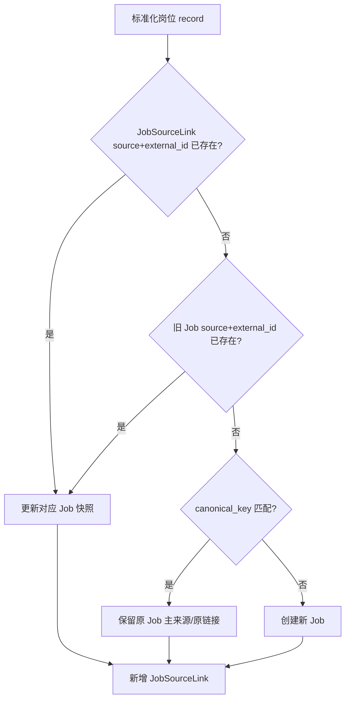
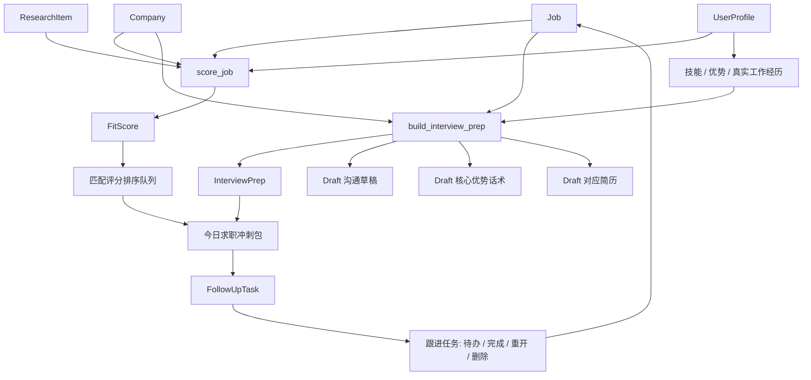
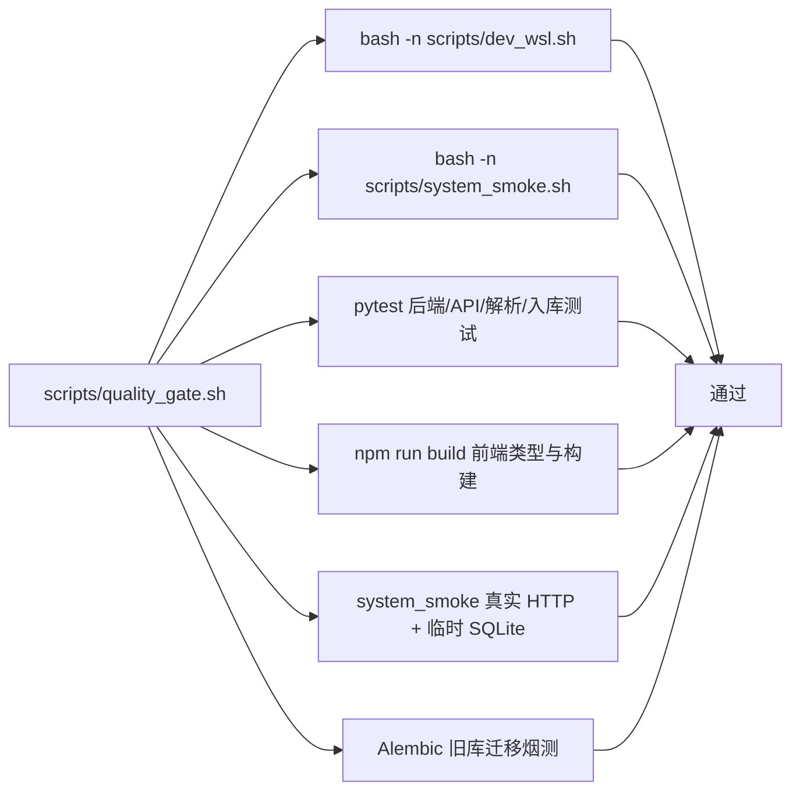

# 数据流转流程图

## 岗位主链路

```mermaid
flowchart TD
    A[外部来源] --> A1[BOSS / 智联 宿主机 OpenCLI]
    A --> A2[CSV / XLSX]
    A --> A3[手动新增]
    A --> A4[公众号 / 元宝]
    A --> A5[beBee]

    A1 --> A6[host_opencli_import.py 输出 CSV 并 POST /api/jobs/import]
    A6 --> B[TabularFileCollector.collect]
    A2 --> B
    A4 --> B
    A5 --> B
    A3 --> C[normalize_record]

    B --> C[normalizer.normalize_record]
    C --> D[importer.upsert_job_record(s)]

    D --> E[Company]
    D --> F[Job]
    D --> G[JobSourceLink]

    G --> H[来源证据: source + external_id + url + raw_payload]
    F --> I[岗位池 UI]
    E --> J[公司调研 UI]
```

## 运行边界

```mermaid
flowchart TD
    S[单进程部署 scripts/app.sh · 推荐日常] --> B0[FastAPI /api + frontend/dist :8000]
    A[本地开发 · 改代码调试] --> B[FastAPI /api :8000]
    A --> C[Vite 前端 :5173]
    D[Docker Compose · 备用 Windows 无 WSL] --> B2[FastAPI /api + frontend/dist :8000]
    B0 --> DB0[(SQLite ./data/job_one_stop/)]
    B --> DB0
    B2 --> DB2[(SQLite volume /data/job_one_stop.sqlite3)]
    O[宿主机 OpenCLI] --> T[tools/host_opencli_import.py]
    T --> G[/api/jobs/import]
    G --> B0
    G --> B
    G --> B2

    H[浏览器] --> J[http://127.0.0.1:8000/]
    H --> I[http://127.0.0.1:5173/]
    J --> B0
    I --> C
    C --> B
    J --> B2
```

> 单进程部署与本地开发共用 `./data/job_one_stop/` 数据库、同监听 :8000，不能同时启动；Docker 用独立 volume，与前两者不互通。

## 去重与来源证据



## 外部个人上下文（Phase 0，只读）

```mermaid
flowchart LR
    A[JOB_ONE_STOP_CONTEXT_REPO_PATH] --> B[ContextRepository 白名单]
    B --> C[README]
    B --> D[24 求职决策规则]
    B --> E[PROFILE]
    B --> F[23 岗位看板]
    B --> G[job-pipeline/cards]
    B --> H[/api/context/status]
    H --> I[仅可用状态]
```

读取始终只读、只走 `ContextRepository` 白名单，不返回宿主机绝对路径。SQLite 保存应用运行数据；外部 Markdown 是聊天分析的只读上下文。

**Phase 2 写回已落地（唯一写入通道）**：本人在 Web 聊天的已入库候选卡上点「写入看板」时（点击前原样预览将写入的整行），由 `ContextWriter`（`services/board_write.py`）在白名单 `board` 文件的「收集箱」列内**插入一行**——不改写/删除既有内容、不创建/移动/删除文件、不 EOF 追加。除此之外没有任何写入路径（AST 绊线测试锁定 `ContextWriter` 引用只出现在 `context_repository.py` / `board_write.py` / `main.py`）。看板列＝岗位状态唯一事实源，状态流转由本人在 Obsidian 拖卡完成，应用绝不写「移动卡片/状态变更」类内容。详见 CLAUDE.md 顶部 Phase 2 边界与红线 §10。

## 评分、准备与跟进闭环



## 前端交互数据流

```mermaid
flowchart TD
    A[React App loadAll] --> B[/api/jobs]
    A --> C[/api/companies]
    A --> D[/api/collect/runs]
    A --> E[/api/drafts]
    A --> F[/api/follow-ups]
    A --> G[/api/profile]
    A --> H[/api/ai/status]

    B --> I[岗位池分页 10 条/页]
    C --> J[公司调研分页 10 条/页]
    B --> K[匹配评分排序队列]
    E --> L[面试准备/准备素材]
    F --> M[跟进任务闭环]

    I --> N[岗位抽屉]
    J --> N
    K --> N
    M --> N
```

## 质量门禁


